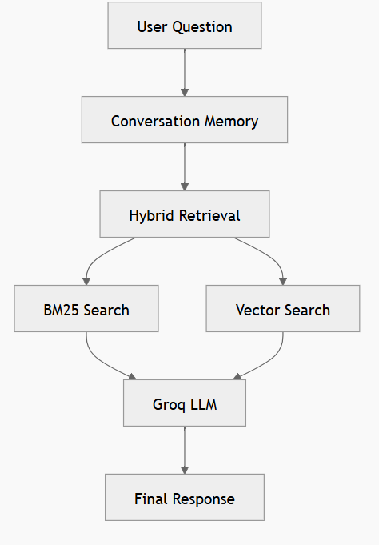
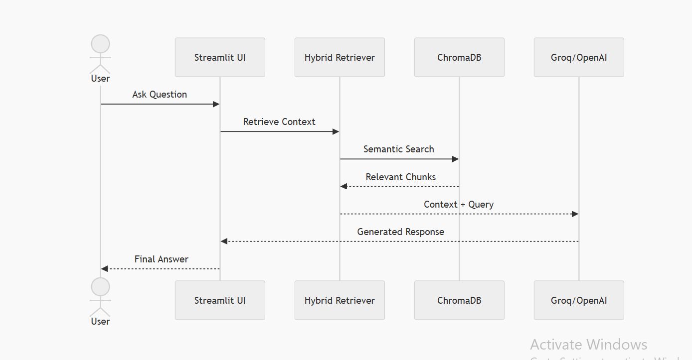
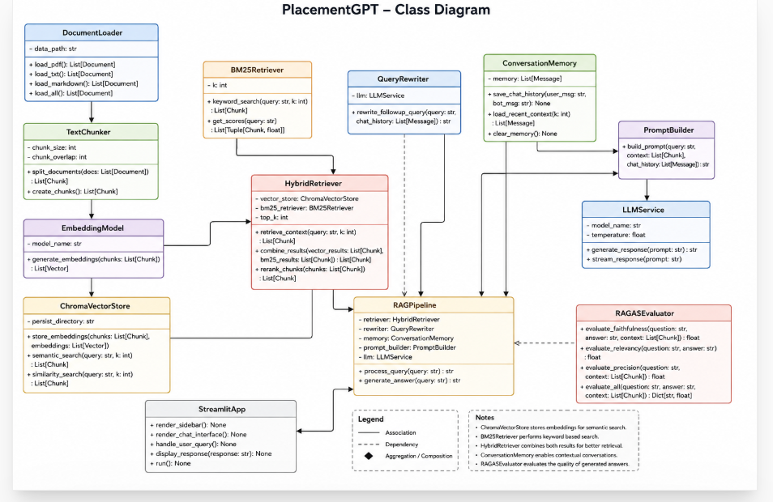
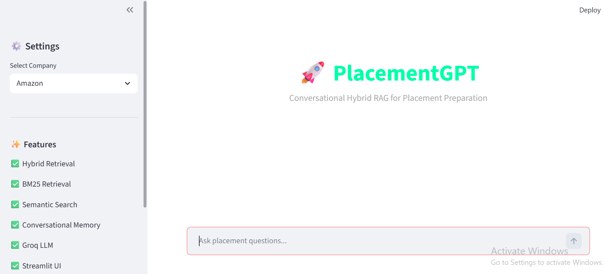
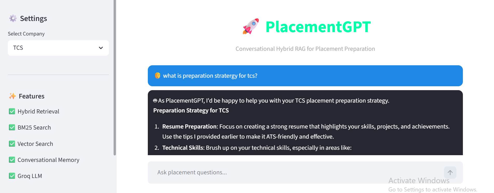
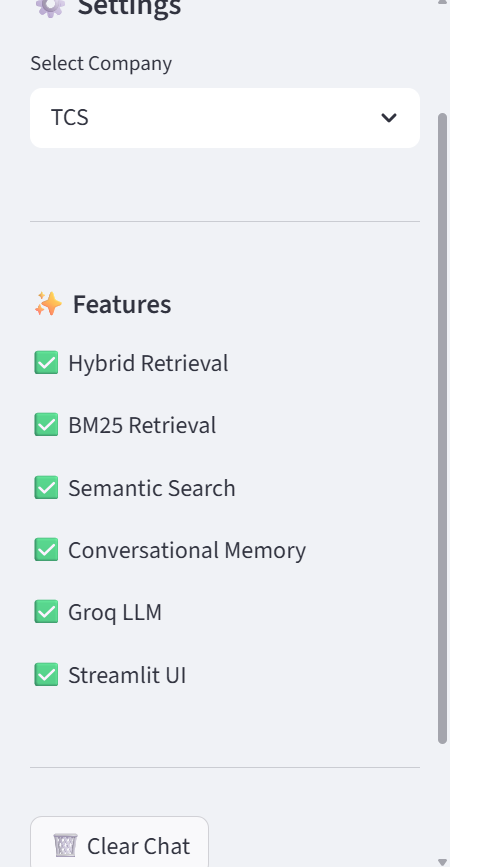

#PlacementGPT 🚀
Conversational Hybrid RAG for Placement Preparation

PlacementGPT is a Conversational Hybrid RAG (Retrieval-Augmented Generation) system designed to help students prepare company-wise for placements using AI-powered contextual conversations.

The system supports:

Context-aware conversations
Follow-up question understanding
Hybrid Retrieval (BM25 + Semantic Search)
Conversational memory
Intelligent document-based answering

Users can upload interview experiences, DSA notes, HR questions, resumes, and preparation PDFs, then interact with the chatbot naturally like ChatGPT.

✨ Features

✅ Conversational Chat Interface
✅ Hybrid Retrieval (BM25 + Vector Search)
✅ Follow-up Question Understanding
✅ Query Rewriting
✅ Conversational Memory
✅ Company-wise Preparation
✅ ChromaDB Vector Storage
✅ Streamlit UI
✅ RAGAS Evaluation Metrics

---

# 🧠 Flowchart







---

# 📸 Screenshots

## 🏠 Home Page



---

## 💬 Chat Interface



---

## ⚙️ Sidebar



---

# ⚙️ Tech Stack

- Python
- LangChain
- ChromaDB
- BM25
- HuggingFace Embeddings
- Streamlit
- Groq API

---

# 🚀 Run Project

```bash
streamlit run app.py
```